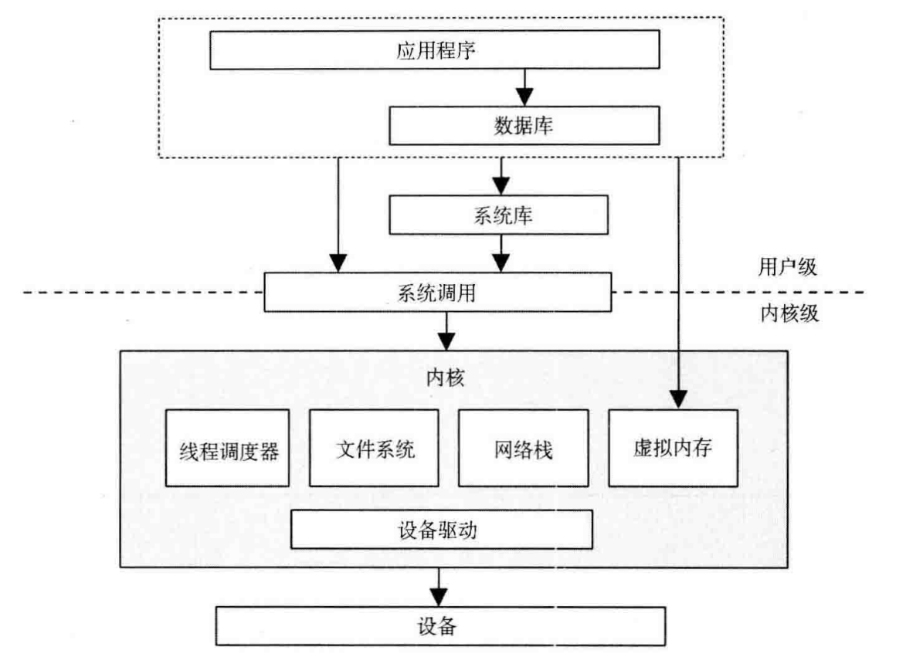
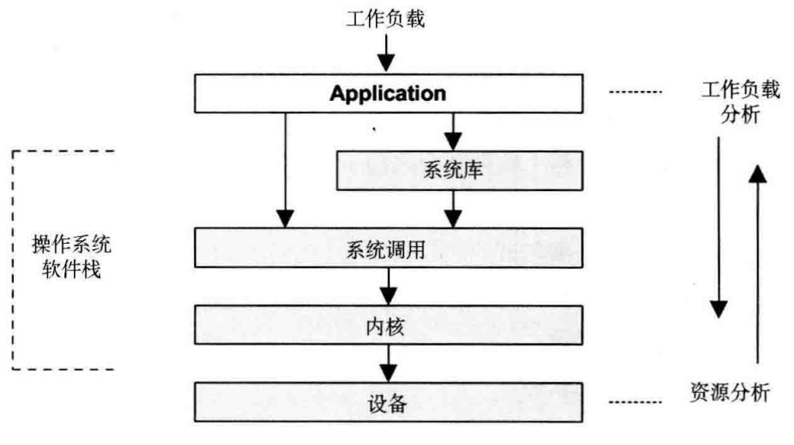

# Preface 1

古往今来有很多重要的系统度量问题，如"如何度量网络繁忙程度"，"如何得知耨太机器是否还或者"，"服务中断是因为某个进程死锁了，还是机器出了问题"，或是"我们的集群中用SSD替换磁盘的比例应该多大"等等。

这些问题的答案都不简单——正确答案往往构建在对操作系统的深刻理解基础上，设置构建在统计学和统计实验基础上。

本书从绪论之后，就开始介绍"方法"——概念、模型、观测和实验手段。本书介绍了实验和观测方法，包括内存、CPU、文件系统、存储硬件、网络等各方面。而且在介绍方法之前会摄入介绍系统，原理。

# Preface 2

对于性能优化，最大的挑战就是性能分析，而性能分析要求我们对操作系统、网络的性能了如指掌，明晰跟部分的执行时间数量级，做出合理判断。这些在书中很详细的讨论，让读者可以明确地将这些性能指标应用在80:20法则上。

了解系统性能指标后，就需要找到合适的工具对可能存在的瓶颈进行分析，这要求我们具备全面的知识，涉及CPU性能、内存性能、磁盘性能、文件系统性能、网络协议栈性能等方方面面，好在本书详细介绍了诸如DTrace、vmstat、mpstat、sar、SystemTap等工具。

单个进程的性能分析是简单的，因为可以定位到system-call或library-call级别，然后对照代码很快解决，但整个业务的性能分析是复杂的，这涉及多个业务单元、庞大的系统组件。麻烦的是，往往造成性能问题的还不是单元本身，而是单元和单元相连接的网络服务。这就要有一套科学的分析方法，来找到整个系统业务中的瓶颈所在。书中介绍了包括随机变动、诊断循环等多个方法，并介绍了设计分析的数学建模和概念。不要忽视数学在性能分析中的作用，实际应用中，我就利用方差和平均值的变化规律科学地分辨一套系统到底是否应该扩容。

找到了性能瓶颈，下一步就是解决问题。当然解决问题的最好办法就是改代码，但不能在短时间修改代码的时候，对系统进行优化也可以实现这一目的。这就要求对系统的各个环节都要明白其工作原理和联系。本书第3章详细讨论了操作系统，在不改代码的情况下优化系统，就是优化内存的分配比例，就是优化CPU亲和度，就是尝试各种调度算法，就是做操作系统层面的各种网络参数调优。

# Preface 3

人类正在用软件重构这个世界。不言而喻，软件对这个世界的人类的重要性也越来越大。软件的健康与否关系这世界的安危。不幸的是，软件的总体健康状况并不乐观，问题很多。

Bug，是软件行业的一个永恒话题，是破坏软件质量的头号大敌。

除了Bug，性能问题是威胁软件健康的另一个大敌。简单来说，把软件中的错误归入Bug一类。把那些在速度、资源消耗、工作量等方面的不满意表现纳入性能问题。

发现Bug根源的过程一般成为调试，Debug。纠正性能问题，提高软件性能的努力被成为调优，Tune。不论调试，还是调优都不是简单的事。对软件工程师的技术要求很高。一些复杂的问题，通常需要多方面的知识，需要对系统有全面了解，即有大局观，能俯瞰全局，又能探微索隐，深入到关键的细节，可谓是"致广大而尽精微"。

如果一定要把调试和调优的难度比较一下，调优的难度更大。简单的解释是，调试的主要目标是寻找Bug，Bug固定存在软件中的某个点。因此调试时可以通过断点等技术把软件静止下来，慢慢分析。而调优必须关注一个动态的过程，观察一段时间内的软件行为。调优常常不可以把软件中断下来静止分析，而需要以统计学的方法或其他技术对软件做长时间监视。

# Preface 4

性能调优是每一个系统工程师最重要的技能，也是衡量其水平高低的不二法门。本书首先体积性能优化的方法论和常见性能检测工具的使用，具体内容更是设计可能影响Linux系统性能的各方面，从操作系统、应用程序、CPU、内存、文件系统、磁盘到网络，无所不包。

# 第1章 绪论

## 1.1 系统性能

系统性能是对整个系统的研究，包括了所有的硬件组件和整个软件栈。所有数据路径上和软硬件上所发生的事情都包括在内，因为这些都有可能影响性能。对于分布式系统来说，这意味着多台服务器和多个应用。**如果你还没有你的环境的一张示意图，用来显示数据的路径，赶紧找一张或者自己画一张**。

下图是单台服务器上的通用系统软件栈，包括OS内核、数据库和应用程序层。"全栈"(entire stack)有时一般仅仅指的是应用程序环境，包括数据库、应用程序、以及网站服务器。当论及系统性能时，全栈表示所有的事情，包括数据库和内核。

## 1.2 人员

系统溪能是一项需要多类人员参数的事务，包括系统管理员、技术支持人员、应用开发者、数据库管理员和网络管理员。对于他们的大多数人员，性能是一项兼职的事情，他们可能会有发掘性能的倾向，但仅限于本职工作范围内。

一些公司会雇佣性能工程师，其主要任务是维护系统性能。与多个团队协同工作，对环境做全局性的研究，执行一些对解决复杂性能问题至关重要的操作。与此同时，开发更好的工具，对整个环境做系统级分析(system-wide analysis)，为容量规划(capacity planning)定义指标。

## 1.3 事情

性能领域包括了以下的事情，按理想的执行顺序排列如下：

1. 设置性能目标和建立性能模板
2. 基于软件或硬件原型进行性能特征归纳
3. 对开发代码进行性能分析(软件整合之前)
4. 执行软件非回归性测试(软件发布前或发布后)
5. 针对软件发布版本的基准测试
6. 目标环境中的概念验证(Proof-of-concept)测试
7. 生产环境部署的配置优化
8. 监控生产环境中运行的软件
9. 特定问题的性能分析

步骤1-5是传统软件产品开发过程的一部分。产品发行后，接下来是么是在客户环境中进行概念验证测试，要么直接部署和配置。如果客户环境中碰到问题(步骤6-9)，这说明该问题在软件开发阶段没有得到发现和修复。

## 1.4 视角

性能是可以从不同的视角来审视的。下图展示了两种性能分析的视角:负载分析(workload analysis)和资源分析(resource analysis),二者从不同的方向对软件栈做分析。

系统管理员作为系统资源的负责人，通常采用资源分析视角。应用程序开发人员，对最终实现的负载性能负责，通常采用负载分析视角。

## 1.5 性能是充满挑战的

系统性能是主观的、复杂的，而且常常是多问题并存的。

### 1.5.1 性能是主观的

考虑下面的信息：

*磁盘的平均I/O响应时间是1ms*

这是好还是坏？响应时间或者是延时，虽然作为最好的衡量指标之一，但还是难以用来说明延时的情况。从某种程度上说，一个给定指标是好或坏取决于应用开发人员和最终用户的性能预期。

### 1.5.2 系统是复杂的

性能问题可能出在子系统之间复杂的相互关联中，即便这些子系统隔离时表现得都很好。也可能由于连锁故障(cascading failure)出现性能问题，这指的是一个出现故障的组件会导致其他组件产生性能问题。要理解这些产生的问题，你必须理清组件之间的关系，还要了解他们是怎样协作的。

瓶颈往往是复杂的，还会以意想不到的方式相互联系。修复了一个问题可能只是把瓶颈推向了系统的其他地方，导致系统的整体性能并没有得到期望的提升。

除了系统的复杂性之外，生产环境负载的复杂特性也可能会导致性能问题。在实验室环境很难重现这类情况，或只能间歇式地重现。

解决复杂的性能问题常常需要全局性的方法。整个系统——包括自身内部和外部的交互——都可能需要被调查研究。

### 1.5.3 可能有多个问题并存

找到一个性能问题点往往并不是问题本身，在复杂的软件中通常会有多个问题。一般情况下，成熟的软件，即便是那些被认为拥有高性能的软件，也会有不少已知的但扔未被修复的性能问题。这就造成了性能分析的又一个难点：真正的任务不是寻找问题，而是辨别问题或者说是辨别哪些问题是最重要的。

要做到这一点，性能分析必须量化(quantify)问题的重要程度。有一个指标非常适合用来量化性能，那就是延时(latency).

## 1.6 延时

